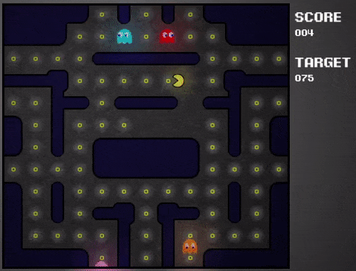
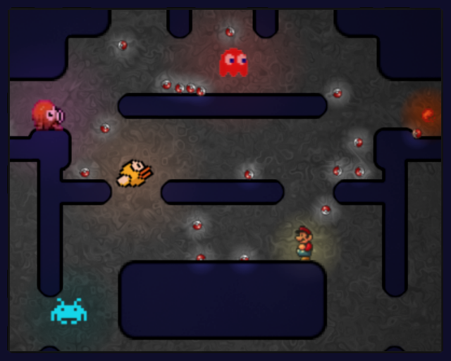

# ldj49

Game made during the ludum dare 49 event.  
Game page: https://ldjam.com/events/ludum-dare/49/a-totally-normal-pacman
Windows executable: https://leandro4002.itch.io/a-totally-normal-pacman

This is just a totally normal pacman game. But weird stuff seems to happen, the thunderstorm going on outside is causing glitches in the game.

There is still a rare bug where the ghosts may have incorrect positions.

Ludum Dare 49 theme: Unstable

## Images:

